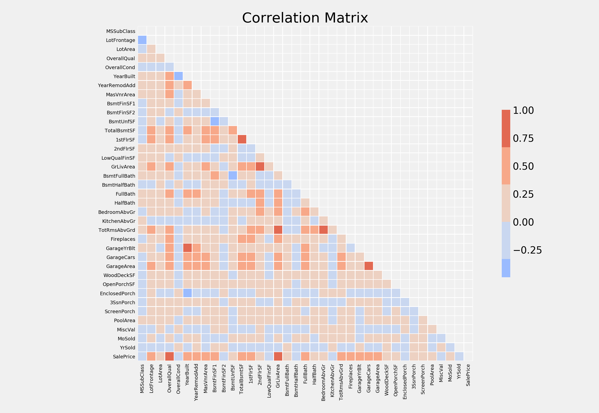
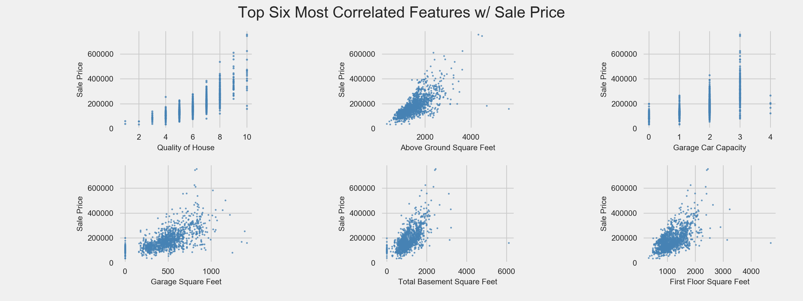
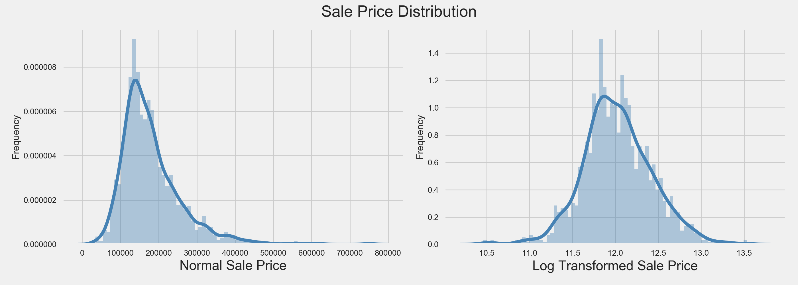

# House Pricing Advanced Regression

Predicted housing prices in Ames, Iowa based on 79 explanatory features using eXtreme Gradient Boosting (XGBoost) model. A test RMSLE of 0.12699 ranks in the top 35% of competition leaderboard.

## Exploratory Data Analysis

Observing the original 79 features in the correlation matrix below, a majority appear positively correlated with the target variable 'SalePrice.' The overall quality of the house and above ground square footage appear to have the strongest correlation with 'SalePrice.' Conversely, the year the house was last sold was negatively correlated with 'SalePrice.'

 
Calculating the exact correlation for each relationship from the correlation matrix above, the following six features were most correlated with 'SalePrice.' There does appear to be a few outliers in the Garage Square Feet and Above Ground Square Feet features, large houses for surprisingly lower prices.

 
When plotting the distribution of the target variable 'SalePrice,' we see that it is right skewed (Left Plot). Since linear models work best with normally distributed data, I log-transformed it (Right Plot).

## Data Cleaning

Began by removing all features composed of 25% or more null values. Then utilized [fancyimpute](https://pypi.python.org/pypi/fancyimpute)'s KNN imputation algorithm to impute null values in all continuous features, using k=3. For missing values in categorical features, I imputed the mode. I then scaled all continuous features and created dummy variables for each categorical feature. The resulting cleaned feature matrix, included 232 features.

## Model Selection

With such a large number of variables, and potentially high collinearity, I started with L1 and L2 regularization regressions to account for the high-dimensional dataset. Gridsearching over various hyperparameters for each regression model, Ridge (L2) outperformed Lasso (L1). I next gridsearched on an ElasticNet regression model in hopes of combining the strengths of Lasso and Ridge. However all three were of no competition to my final eXtreme Gradient Boosting model.

An advanced implementation of the gradient boosting algorithm, eXtreme Gradient Boosting (XGBoost), is a parallelizable algorithm with built-in regularization to control over-fitting. After gridsearching over various hyperparameters, my final model consists of:
~~~
Best Params: {'learning_rate': 0.05, 'max_depth': 2,
    'min_child_weight': 3, 'n_estimators': 1000, 'reg_alpha': 0.1}
~~~

After gridsearching each of the aforementioned algorithms (with a log-transformed target variable), the best results were:

| Model  | GridSearch Best MSE Score |
|---|---|
| L1 Regularization (Lasso)  | 0.163827  |
| L2 Regularization (Ridge)  | 0.159123  |
| ElasticNet  | 0.130522  |
| XGBoost | 0.108130   |

## Final Results
When tested on the validation set of the training data, the final XGBoost model recorded an RMSLE of 0.16398. More importantly, it scored an RMSLE of 0.12699 on the test data, ranking in the top 35% of the competition leaderboard.
