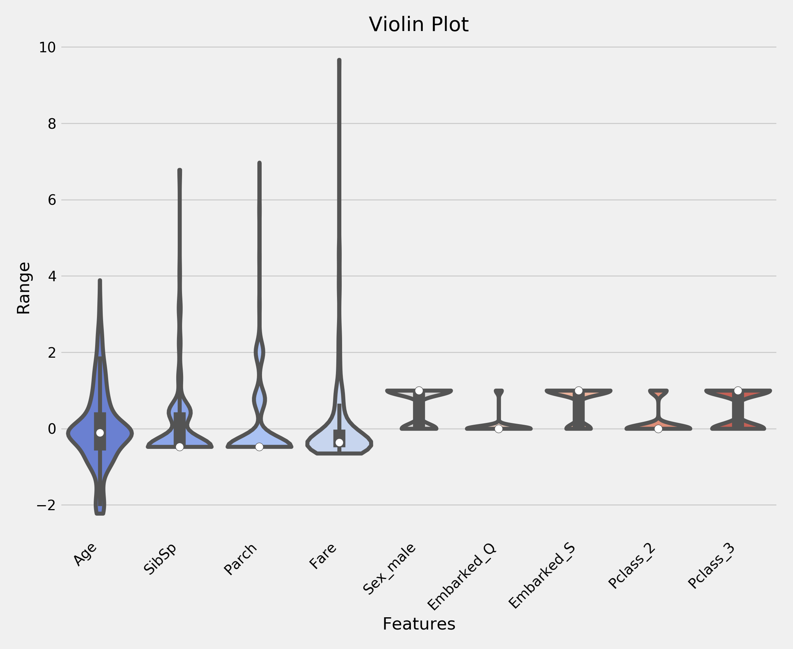

# Titanic: Machine Learning from Disaster Kaggle Competition

Code for solving the Titanic survival prediction competition on [Kaggle](https://www.kaggle.com/c/titanic). Utilizing a Random Forest as my final model, I was able to obtain an accuracy score of 78.468% on the test data, ranking in the top 34% of the competition.

## Exploratory Data Analysis

Digging into the training data, made up of 12 features and 891 observations, I observed many of the common assumptions about the characteristics of survivors. Females and those in higher passenger classes had a much higher survival rate.

#### Variable Description
* Survived: Survived (1) or died (0)
* Pclass: Passenger's class
* Name: Passenger's name
* Sex: Passenger's sex
* Age: Passenger's age
* SibSp: Number of siblings/spouses aboard
* Parch: Number of parents/children aboard
* Ticket: Ticket number
* Fare: Fare
* Cabin: Cabin
* Embarked: Port of embarkation

Taking a look at the correlation matrix below, we see that, again, what class the passenger is in correlated the most with their survival. SibSp (Number of siblings/spouses aboard) and Parch (Number of parents/children aboard) were the two features with the strongest correlation, so it may make sense to combine them in some way moving forward.

### Data Cleaning

Age, Cabin, and Embarked features all contained missing data. For Age, I imputed the median age (28.0) of all passengers in the training data. The Embarked feature only contained two nulls in the training data, for which I imputed the most common port of embarkation ('Southampton'). With a high-number of nulls (77.2% of training data), I decided to drop the Cabin feature.

Next, I made dummy variables for Sex, Embarked, and Pclass. Finally, I standardized the remaining continuous variables. After doing so, I observed the following violin plots, which visualize the outliers in Fare, SibSp (Number of siblings/spouses aboard), and Parch (Number of parents/children aboard).

After cleaning the data, I observed the following correlation matrix. It is very clear that males and those that paid less for their ticket and thus were in lower classes had lower survival rates. However, there may be other features not included here, that may be useful in predicting survival. I explore two below in the feature engineering section.

### Feature Engineering

With SibSp (Number of siblings/spouses aboard) and Parch (Number of parents/children aboard) being highly-correlated, I combined the two into a Family_Size feature. I then created dummy variables to indicate the size of family that each passenger was traveling with. Those traveling alone I marked as Single. For those with Family_Size equal to two, I used Small_Family. For those traveling with three to four family members, I used Medium_Family and for those with a family larger than 4 I used Large_Family.

Next, with inspiration from [Yassine Ghouzam's tutotial](https://www.kaggle.com/yassineghouzam/titanic-top-4-with-ensemble-modeling), I extracted the title from each passenger's name. Of the 17 titles, I elected to use 'Mr', 'Mrs', 'Miss', and 'Other' as dummy variables.

## Model Selection

Cross validating on eight vanilla models, I found the following results after performing a test/train split on the training data.

| Model  | Avg. Accuracy  | Std. Dev.  |
|---|---|---|
| Logistic Regression  | 0.81  | 0.033469  |
| K-Nearest Neighbors  | 0.79  | 0.051065  |
| Decision Tree  | 0.80  | 0.036993  |
| Naive Bayes  |  0.79 | 0.035720  |
| Random Forest  | 0.82  | 0.035535  |
| AdaBoost  | 0.80  | 0.040431  |
| Gradient Boosting  | 0.83  | 0.043686  |
| SVC  | 0.81  | 0.037898  |
| Average of all  | 0.808  |   |

From these results, I decided to grid search for optimal hyper-parameters on the top three performing models (Gradient Boosting, SVC, and Random Forest). After doing so, Random Forest (0.85 accuracy) outperformed both Gradient Boosting (0.837) and SVC (0.823) when cross validated on the training set of the test/train split training data. Thus, I used a Random Forest with the following hyper-parameters as my final model:
~~~
Best Params: {'bootstrap': True, 'criterion': 'gini', 'max_depth':
None, 'max_features': 8, 'min_samples_leaf': 2, 'min_samples_split': 2, 'n_estimators': 200}
~~~

### Final Results

My final Random Forest model, when tested on the testing set of the test/train split training data, scored 0.8385 accuracy. When tested on the actual test data, the model had an accuracy score of 0.7846.
